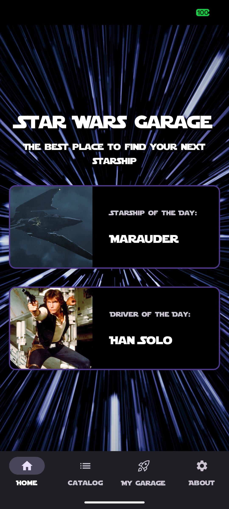
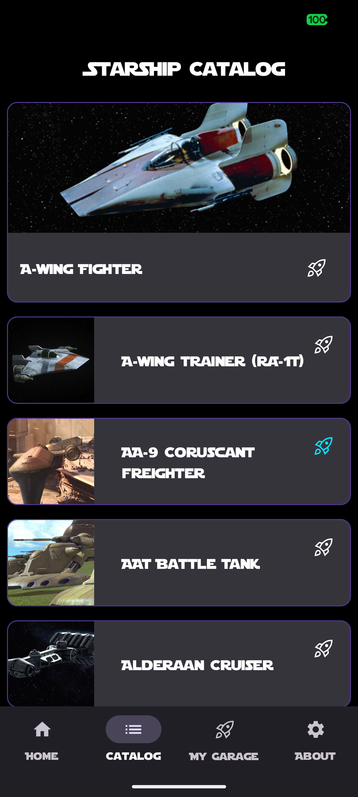
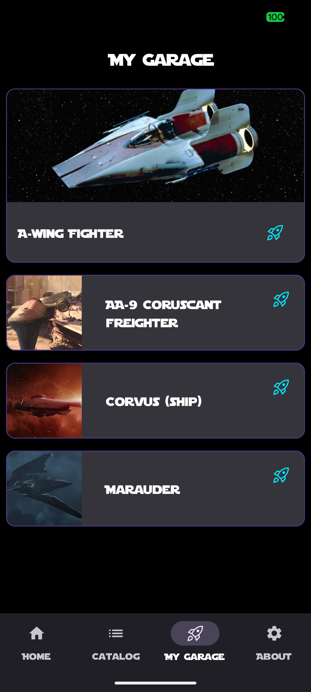

# Star Wars Garage App 🚀

An Android app that displays **Star Wars starships**, fetching data from a public API and presenting
it with a modern, clean UI built using **Jetpack Compose**.

This project is part of my **Android/Kotlin portfolio** and focuses on best practices in
architecture, performance, and modern Android development.

---

## 📸 Screenshots

  
  
  
  
  
  

---

## ✨ Features

- 📱 **Jetpack Compose UI**
- 🔄 **Pagination** using Paging 3
- 🧠 **MVVM Architecture**
- 🏠 **Home screen** featuring:
    - Daily best Starship
    - Daily drivers showstopper
- 🚀 **Starship details screen**
- 📃 **List of all Starships**
- ⭐️ **Garage with all favorite Starships**
- 🧪 **Continuous Integration** with Bitrise
- 💉 **Dependency Injection** with Hilt
- 🗄️ **Local database** with Room
- 🖼️ **Image loading** with Coil

---

## 🛠 Tech Stack

- **Language:** Kotlin
- **UI:** Jetpack Compose
- **Architecture:** MVVM
- **Networking:** Retrofit
- **Pagination:** Paging 3
- **Database:** Room
- **DI:** Hilt
- **CI:** Bitrise

---

## 🚧 TODO

- ✅ Add **Unit Tests**
- ♿ Improve **Accessibility**
- 🧑‍🚀 Fetch data for **Characters**

---

## 🌱 Nice to Have

- 🧪 UI Tests
- 🪐 Fetch data for **Planets**

---

## 👩‍💻 Author

Created by **Miriam Di Domizio**  
January 2026
